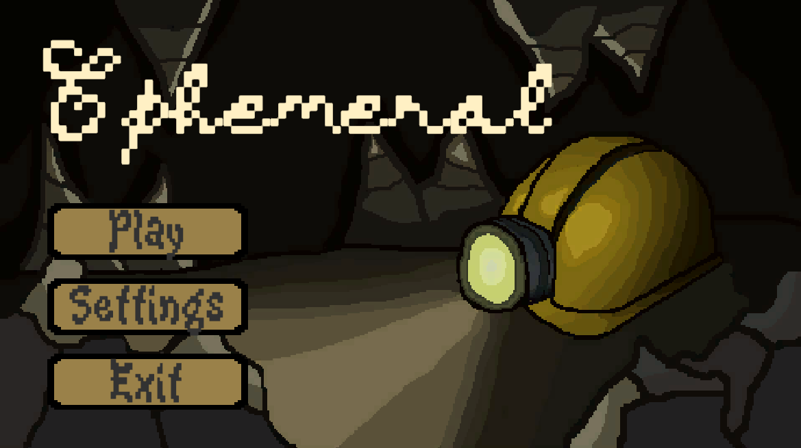
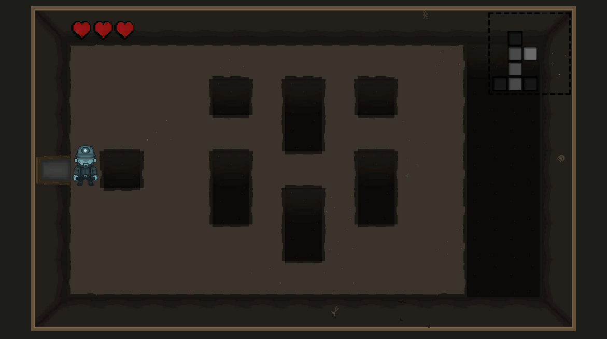
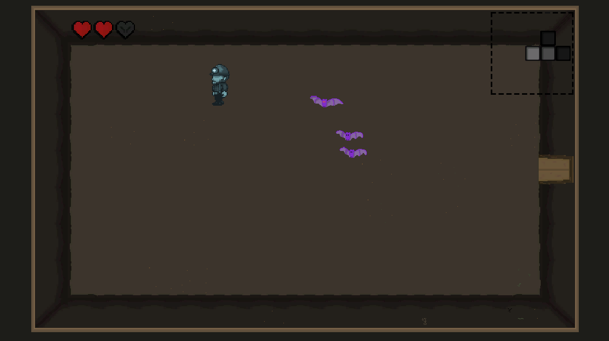
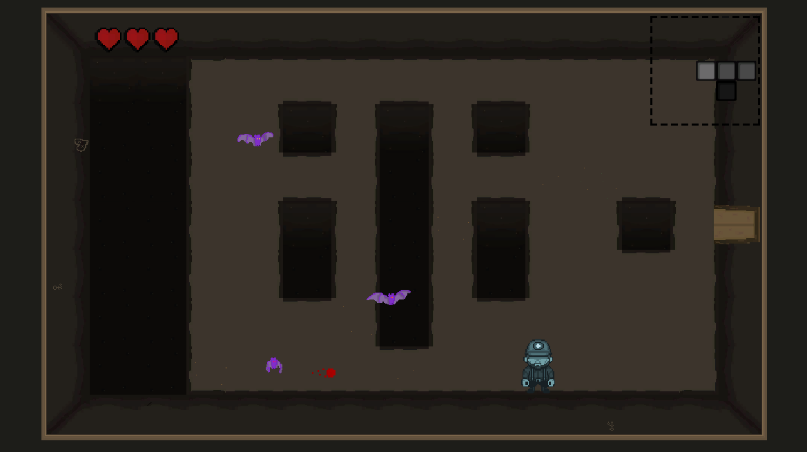

# Ephemeral

*A game dedicated to my grandfather.*

A 2D roguelite about a dead miner descending into the mine where he died, slowly piecing together who he was before the end.

## Play

**[Play Ephemeral on itch.io](https://nicormu.itch.io/ephemeral)** — runs in your browser, no download needed.

## Current state

The game is in early development. Right now it's focused on **procedural mine generation**: randomly generated layouts, room connections with proper doors, floor/wall tiles, environmental decorations, obstacles, and an animated player character.

To see a new dungeons, reload the itch.io page

**Still in progress:** combat, boss encounters, and the memory/story system.

## The idea

You play as a miner who's already dead when the game starts, exploring a mine that should feel familiar but isn't quite right. As he explores, he'll encounter enemies, bosses, and fragments of memories from before his death — pieces that gradually reveal what happened to him.

The procedural generation supports this: every run takes you through the same place, but your path and discoveries shift just enough that it never feels like replaying the same level.

## Running locally

1. Install Unity 6.4+ (Hub or standalone)
2. Clone this repo and open it from the Unity Editor
3. Hit play

No external dependencies or build steps beyond that.

## Credits

Made by **Nicolás (Nicormu)**.

**Juan Andres Granados ([@Juanggs777](https://github.com/Juanggs777))** — thanks for helping with some of the sprites.

Inspired by roguelites like *The Binding of Isaac* and games that make empty spaces feel intentional — but this project is built from scratch, no assets or systems borrowed from other games.