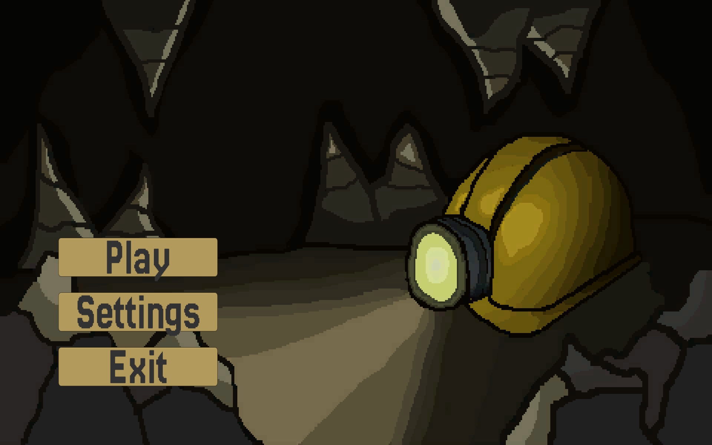
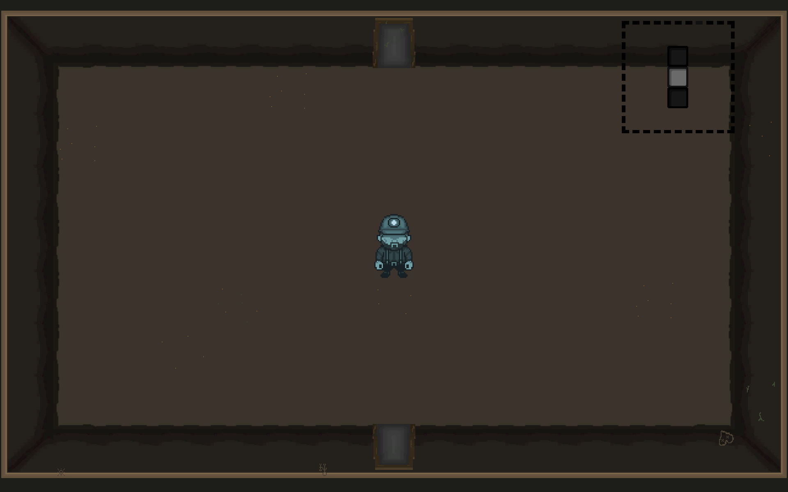

# Ephemeral

*A game dedicated to my grandfather.*

A 2D roguelite about a dead miner descending into the mine where he died, slowly piecing together who he was before the end.

## Play

You can try the current prototype directly in your browser — no download needed:

**[Play Ephemeral on itch.io](https://nicormu.itch.io/ephemeral)**

## What you'll experience right now

The game is in early development, and this build reflects where I'm focusing: **procedural mine generation**. You'll get to walk around a randomly generated dungeon and see the room layouts, tiles, doors, and environmental details come together.

Right now it's an empty canvas — no enemies, no combat, no story moments yet. The rooms are waiting for the content I'll be adding next.

### What's already working

* Randomly generated mine layouts (new layout every run)
* Room connections with proper door placement
* Floor tiles, walls, and environmental decorations
* Obstacles scattered through the dungeon
* Animated player character with movement

### Still in progress

* Enemies and combat
* Boss encounters
* The memory/story system that ties into the mine's atmosphere

## Running locally

**Easy mode:** Use the itch.io link above. It runs in your browser.

**For contributors who want the source open:**

1. Install Unity 6.4+ (Hub or standalone)
2. Clone this repo and open it from the Unity Editor
3. Hit play

That's it. There are no external dependencies or build steps beyond opening it in Unity.

## How the generation works

The mine is built from pre-designed room templates — corridors, dead-ends, intersections, and a few special shapes I handcrafted. When you start a run, these pieces are randomly arranged and connected together by an algorithm that figures out which doors link up to which walls.

Each room is designed by me; the dungeon layout itself is assembled on the fly. This lets me focus on making individual rooms feel good while still getting variety across runs without manually building dozens of full dungeon layouts.

The generation system is currently the main technical focus. I'm using Unity Tilemaps for the visual layers and a custom graph-based approach to figure out room placement and connectivity.

## The idea

You play as a miner who's already dead when the game starts. He wakes up inside a mine that should feel familiar but isn't quite right. As he explores, he'll eventually encounter enemies, bosses, and fragments of memories from before his death — pieces that gradually reveal what happened to him.

The procedural generation is meant to support this: every run takes you through the same place, but your path and discoveries shift just enough that it doesn't feel like replaying the same level.

This is the plan. Right now, there's no story content or memory system in place yet. That comes later.

## Credits

Made by **Nicolás (Nicormu)**.

**Juan Andres Granados ([@Juanggs777](https://github.com/Juanggs777))** — thanks for helping with some of the sprites.

Inspired by roguelites like *The Binding of Isaac* and games that make empty spaces feel intentional — but this project is built from scratch, no assets or systems borrowed from other games.
